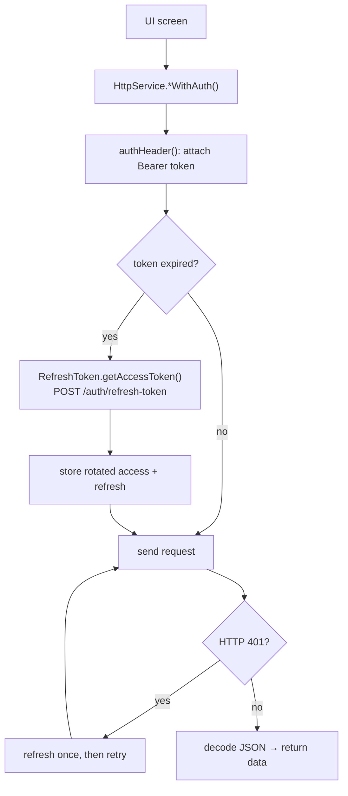
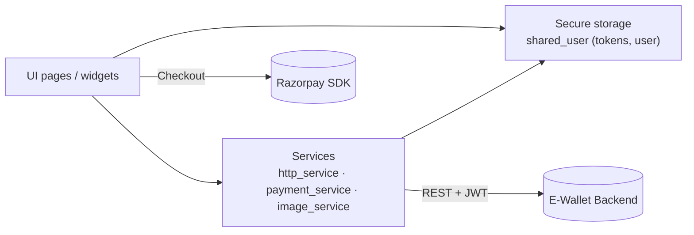

# E-Wallet — Flutter App

A cross-platform digital wallet client for the [E-Wallet backend](../E-Wallet-Backend).
Users can register, log in, manage bank accounts, transfer/deposit/withdraw,
save cards, reset their password via OTP, and **top up their wallet through
Razorpay** (test mode).

## Tech

| Concern | Choice |
|---------|--------|
| Framework | Flutter (Dart 3) |
| State | flutter_bloc |
| Secure storage | flutter_secure_storage |
| Auth | JWT access + refresh (auto-refresh on 401) |
| Payments | razorpay_flutter (Checkout) |

## Architecture notes

- **Networking** is centralized in `lib/services/http_service.dart`. It attaches
  the bearer token, and on a `401` it transparently refreshes the access token
  once (rotating the refresh token) and retries — see `lib/utils/RefreshToken.dart`.
- **Config** is not hard-coded. The backend host is provided at build time via
  `--dart-define` (see below), defaulting to the Android-emulator loopback.
- Tokens are stored in the platform secure store and are never logged.

### Request + auto-refresh flow



### App layers



## Configuration

The backend base URL and Razorpay key are injected at run/build time:

```bash
flutter run \
  --dart-define=API_BASE_URL=http://10.0.2.2:8080 \
  --dart-define=RAZORPAY_KEY_ID=rzp_test_xxxxxxxxxxxxxx
```

| Define | Default | Notes |
|--------|---------|-------|
| `API_BASE_URL` | `http://10.0.2.2:8080` | `10.0.2.2` = host machine from the Android emulator. Use `http://localhost:8080` for web/desktop, or your LAN IP for a physical device. **Use HTTPS in production.** |
| `RAZORPAY_KEY_ID` | _empty_ | Public test key id. The server also returns the key id in the order response, so this is only a fallback. |

## Running

```bash
flutter pub get
flutter run --dart-define=API_BASE_URL=http://10.0.2.2:8080
```

Make sure the backend is running and reachable at `API_BASE_URL`.

### Sign in with Google

The Google client ids live in `lib/utils/shared_user.dart`. For the flow to work,
the backend must have `GOOGLE_OAUTH_ENABLED=true` and `GOOGLE_CLIENT_ID` set to the
**serverClientId** used here (the ID token's audience). The app posts the Google ID
token to `POST /api/v1/auth/oauth/google`, which verifies it server-side and returns
the app's own JWTs.

## Live web demo (free, no download)

The app also builds for **Flutter Web** and deploys to **GitHub Pages** for a
clickable demo link — testers walk through the whole app in a browser, no APK.

- **One-click demo:** the sign-in screen has an **"🚀 Explore Live Demo"** button
  that calls `POST /auth/demo` — no signup needed; the visitor lands straight on a
  **pre-populated dashboard** (two accounts with reconciling balances + transaction
  history) and can then transfer, top-up, etc.

- **Cross-platform Razorpay:** the showcase top-up works on web too, via Razorpay's
  **Checkout JS** (`web/index.html` loads `checkout.js`); mobile keeps the native
  SDK. The switch is a conditional import in `lib/services/razorpay/`.
- **Web-only caveats:** camera QR-scanning and biometric unlock are mobile-only and
  are safely skipped on web; every core flow (auth, accounts, transfer, history,
  cards, **top-up**) works.
- **Deploy:** the `Deploy Web Demo (GitHub Pages)` workflow builds with the right
  `--base-href` and publishes to Pages. **Required:** set repo **Variable**
  `API_BASE_URL` to your deployed backend HTTPS URL (default for Pages:
  `https://springpay.duckdns.org`).
  Optionally set `RAZORPAY_KEY_ID` (public test key) under Settings → Secrets and
  variables → Actions → Variables. The workflow writes `web/api-config.json` so the
  web app loads the backend URL at runtime. Enable Pages (Settings → Pages → Source:
  GitHub Actions).
- The demo needs the backend reachable over **HTTPS** with the Pages origin in
  `APP_CORS_ALLOWED_ORIGINS` (e.g. `https://madhavchhabra.github.io`) — see the
  backend `DEPLOYMENT.md`.

Build locally: `flutter build web --dart-define=API_BASE_URL=https://your-backend`.

## Razorpay top-up flow

1. Home → **Top Up** → enter an amount → **Pay with Razorpay**.
2. The app asks the backend to create an order (`POST /payments/razorpay/order`).
3. The Razorpay Checkout sheet opens (test mode — use Razorpay's
   [test cards](https://razorpay.com/docs/payments/payments/test-card-details/)).
4. On success, the signed result is sent to the backend
   (`POST /payments/razorpay/verify`), which verifies the signature server-side
   and credits the wallet. No real money moves.

Enable Razorpay on the backend with `RAZORPAY_ENABLED=true` and test keys.

## Project structure

```
lib/
├── blocs/        # BLoC state management
├── models/       # Data models
├── services/     # http_service, payment_service
├── ui/pages/     # Screens
├── ui/widgets/   # Reusable widgets
└── utils/        # Config, secure storage, auth headers, token refresh
```
